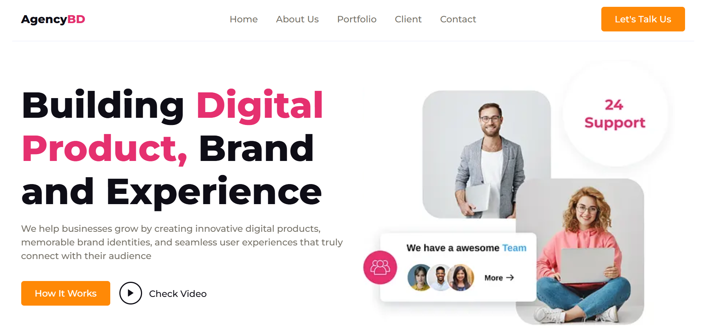

# 🏢 AgencyBD



A sleek and professional **digital agency landing page** that showcases creative services, portfolio highlights, client testimonials, and a newsletter section.  
Built with **HTML**, **CSS**, and **JavaScript**, and enhanced using **Swiper.js** and **ScrollReveal** for modern animations and smooth user experiences.

---

## 🚀 Features

- 💼 **Modern Agency Design** — professional layout for showcasing digital services.  
- 🖥️ **Responsive Layout** — works seamlessly across all devices.  
- ✨ **Animated Elements** — powered by ScrollReveal.  
- 🌀 **Client Testimonial Slider** — implemented using Swiper.js.  
- 📊 **Portfolio Section** — highlights company experience and services.  
- 📬 **Newsletter Subscription Form** — for user engagement.  
- 📱 **Interactive Navbar** — includes mobile-friendly menu.  
- 🌐 **Footer with Social Links & Contact Info** — easily accessible details.

---

## 🧠 Demo

👉 **Live Demo:** [Click Here](https://fsafiya187.github.io/AgencyBD/) 

---

## 🛠️ Tech Stack

- **HTML5** — page structure  
- **CSS3** — styling and responsiveness  
- **JavaScript (ES6)** — interactivity  
- **Swiper.js** — client feedback carousel  
- **ScrollReveal.js** — on-scroll animations  
- **Remix Icon** — clean, lightweight icons  

---

## ⚙️ How to Use

1. **Clone this repository**
   ```bash
   git clone https://github.com/fsafiya187/AgencyBD.git


2.Navigate to the project folder

cd AgencyBD


3.Open the project
Simply open index.html in your browser.

---

📚 Learning Highlights

Building a responsive multi-section agency landing page.

Adding interactive sliders using Swiper.js.

Using ScrollReveal for subtle animations.

Designing consistent and reusable section components.

Creating a fully functional navigation menu with JavaScript.

---

🧾 License

This project is open source and available under the MIT License

---

💬 Author

Safiya Fathima
🌐 fsafiya187
